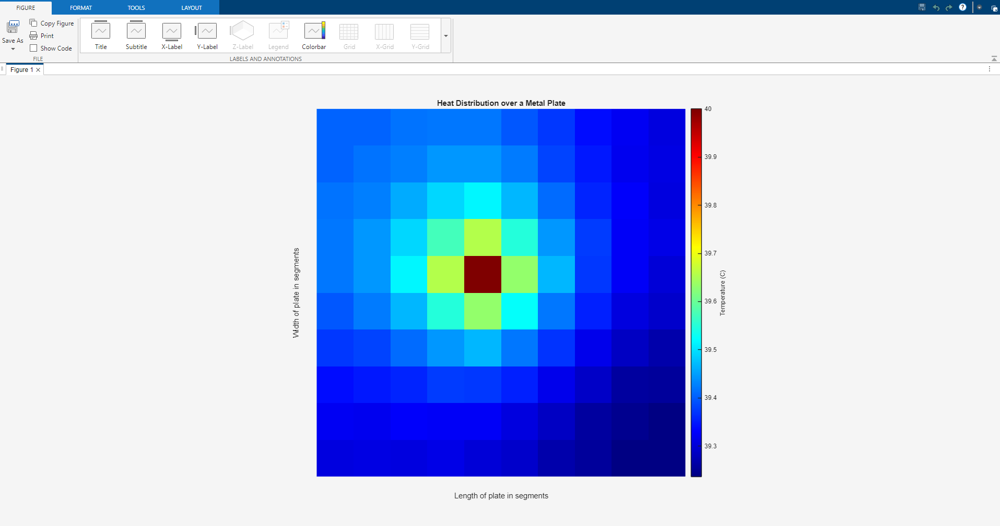

# Heat Transfer Through a Metal Plate
A MATLAB simulation and visualization of transient 2D heat conduction through a square metal plate using finite difference methods.

## Overview
This project models heat transfer through a metal plate subjected to different thermal boundary conditions. The simulation solves the transient heat equation numerically and visualizes the termperature over time using MATLAB.
Methods and Approaches include:
* Finite Difference Method (FDM) for spatial discretization
* Time-stepping scheme for transient temperatures updates
* 2D numerical solution of the heat diffusion equation
* Real-time temperature visualization using contour plots
* Configurable boundary conditions
  
Engineering Applications:
* Heat sink analysis
* Aerospace thermal protection
* Electronics cooling
* Mechanical conponent temperature analysis

## Thermodynamics
```Matlab
syms T(x,y,t)
diff(T,t) = diff(T,x,2) + diff(T,y,2)
```
T = Temperature;
t = time;
x,y = spatial coordinates

## Numerical Method
The simulation uses an explicit finite difference scheme:
```Matlab
T(i,j) = 1/4 * (T(i-1,j) + T(i+1,j) + T(i,j-1) + T(i,j+1))
```
The method iteratively updates the temperature of the plate at each time step

## Example



